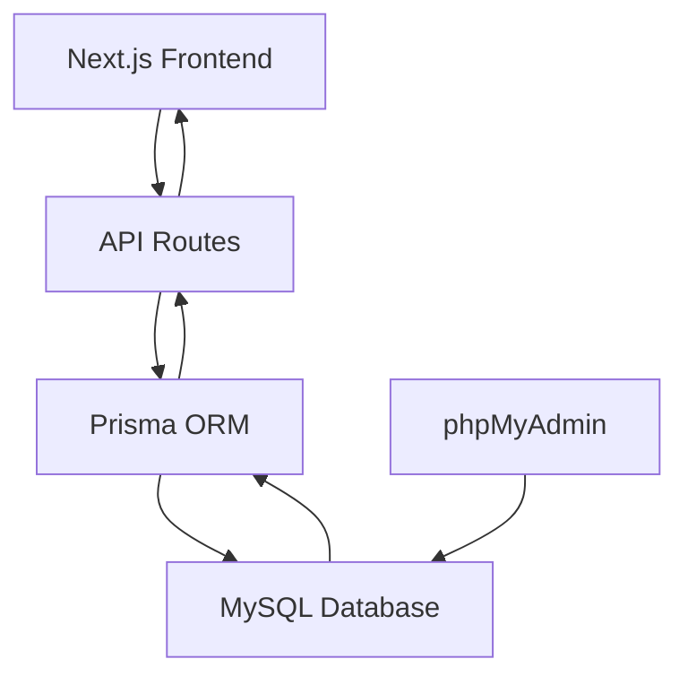

# Database Configuration Design for RenThing with MySQL/phpMyAdmin

## Summary

This document provides a comprehensive guide for configuring localhost phpMyAdmin with MySQL as the main database for the RenThing rental marketplace platform. The configuration ensures all codebase integrations work properly with the new MySQL database while maintaining data integrity and application functionality.

Key aspects covered:
- Database schema design based on code analysis
- Implementation plan with step-by-step instructions
- Troubleshooting common issues
- Backup and rollback procedures

## Overview

This document outlines the design and implementation of configuring localhost phpMyAdmin with MySQL as the main database for the RenThing rental marketplace platform during local development and testing. The configuration will replace any existing database setup and ensure all codebase integrations work properly with the new MySQL database.

## Architecture

### Current State Analysis
- The RenThing platform currently uses Prisma ORM for database operations
- Previous database configurations included SQLite, PostgreSQL, and Supabase
- The project has been migrated to use MariaDB/MySQL with phpMyAdmin for local development
- Database connection is configured through the `DATABASE_URL` environment variable
- Prisma schema definitions are missing and need to be recreated based on code analysis

### Target Architecture
- Local MySQL database hosted on localhost:3306
- Database name: `renthing-db`
- Root user with no password (default XAMPP setup)
- Prisma ORM as the database abstraction layer
- phpMyAdmin for database administration

## Database Schema Design

Based on code analysis, the following models are required:

### User Model
- id: String (Primary Key)
- email: String (Unique)
- password: String (Hashed)
- name: String
- avatar: String (Optional)
- role: String (Enum: admin, vendor, user)
- createdAt: DateTime
- updatedAt: DateTime

### Listing Model
- id: String (Primary Key)
- title: String
- description: String
- price: Float
- location: String
- category: String
- priceUnit: String
- ownerId: String (Foreign Key to User)
- images: String (JSON array)
- createdAt: DateTime
- updatedAt: DateTime

### Booking Model
- id: String (Primary Key)
- userId: String (Foreign Key to User)
- listingId: String (Foreign Key to Listing)
- startDate: DateTime
- endDate: DateTime
- status: String (Enum: pending, confirmed, completed, cancelled)
- createdAt: DateTime
- updatedAt: DateTime

### Review Model
- id: String (Primary Key)
- userId: String (Foreign Key to User)
- listingId: String (Foreign Key to Listing)
- rating: Int
- comment: String
- createdAt: DateTime
- updatedAt: DateTime

### Message Model
- id: String (Primary Key)
- senderId: String (Foreign Key to User)
- receiverId: String (Foreign Key to User)
- content: String
- read: Boolean
- createdAt: DateTime

### Transaction Model
- id: String (Primary Key)
- bookingId: String (Foreign Key to Booking)
- amount: Float
- currency: String
- paymentMethod: String
- status: String
- createdAt: DateTime
- updatedAt: DateTime

### Wishlist Model
- id: String (Primary Key)
- userId: String (Foreign Key to User)
- listingId: String (Foreign Key to Listing)
- createdAt: DateTime

### Achievement Model
- id: String (Primary Key)
- userId: String (Foreign Key to User)
- name: String
- description: String
- icon: String
- earnedAt: DateTime
- expiresAt: DateTime (Optional)

### Purchase Model
- id: String (Primary Key)
- userId: String (Foreign Key to User)
- itemType: String
- itemId: String (Optional)
- amount: Float
- currency: String
- status: String
- createdAt: DateTime

### UserBadge Model
- id: String (Primary Key)
- userId: String (Foreign Key to User)
- badgeType: String
- purchaseId: String (Optional)
- expiresAt: DateTime (Optional)
- createdAt: DateTime

### Voucher Model
- id: String (Primary Key)
- userId: String (Foreign Key to User)
- voucherType: String
- code: String (Unique)
- discount: Float
- used: Boolean
- usedAt: DateTime (Optional)
- expiresAt: DateTime (Optional)
- createdAt: DateTime

### VoucherRedemption Model
- id: String (Primary Key)
- voucherId: String (Foreign Key to Voucher)
- userId: String (Foreign Key to User)
- redeemedAt: DateTime

## Implementation Plan

### 1. Environment Configuration
- Update `.env.local` with MySQL connection string
- Verify phpMyAdmin is running at `http://localhost/phpmyadmin`
- Confirm database `renthing-db` exists
- Verify existing database content if applicable

Before proceeding with the database setup, check if the `renthing-db` database already contains data:

1. Open phpMyAdmin at http://localhost/phpmyadmin
2. Select the `renthing-db` database
3. Check if tables already exist
4. If tables exist, determine if they match the expected schema
5. If data exists, determine if it should be preserved or can be replaced

If the database already contains important data, create a backup before proceeding with any changes.

To create a backup using phpMyAdmin:
1. Open phpMyAdmin at http://localhost/phpmyadmin
2. Select the `renthing-db` database
3. Click the "Export" tab
4. Choose "Quick" export method
5. Select "SQL" as the format
6. Click "Go" to download the backup file

Alternatively, you can create a backup using the command line:
```bash
mysqldump -u root renthing-db > renthing-db-backup.sql
```

### 2. Prisma Schema Creation and Verification
- Create `prisma/schema.prisma` with MySQL provider
- Define all required models based on code analysis
- Add proper relations and constraints
- Thoroughly check and verify all Prisma schemas for completeness

Prisma is already installed in the project as evidenced by the package-lock.json file which lists both `prisma` and `@prisma/client` as dependencies. No additional installation is required.

Before creating the schema, conduct a thorough analysis of the existing codebase to ensure all models are captured:

1. Search for all Prisma model usage throughout the codebase:
   ```bash
   grep -r "prisma\." . --include="*.ts" --include="*.js" > prisma-usage.txt
   ```

2. Identify all unique models referenced in the codebase by examining the prisma-usage.txt file

3. Verify that all models identified in the schema match the actual usage in the codebase

4. Check for any additional fields or relationships that might be needed based on how the models are used

5. Validate the schema by running:
   ```bash
   npx prisma validate
   ```

6. After creating the schema, generate the client and check for any TypeScript errors that might indicate schema issues:
   ```bash
   npx prisma generate
   ```

The Prisma schema will be created with the following content:

```prisma
// Prisma Schema for RenThing with MySQL
generator client {
  provider = "prisma-client-js"
}

datasource db {
  provider = "mysql"
  url      = env("DATABASE_URL")
}

// User roles
enum Role {
  admin
  vendor
  user
}

// Booking statuses
enum BookingStatus {
  pending
  confirmed
  completed
  cancelled
}

// User model
model User {
  id            String      @id @default(uuid())
  email         String      @unique
  password      String?
  name          String?
  avatar        String?
  role          Role        @default(user)
  createdAt     DateTime    @default(now()) @db.DateTime(6)
  updatedAt     DateTime    @updatedAt @db.DateTime(6)
  
  // Relations
  listings      Listing[]   
  bookings      Booking[]   
  reviews       Review[]    
  messagesSent  Message[]   @relation("sentMessages")
  messagesRec   Message[]   @relation("receivedMessages")
  wishlists     Wishlist[]
  achievements  Achievement[]
  transactions  Transaction[]
  purchases     Purchase[]
  userBadges    UserBadge[]
  vouchers      Voucher[]
  voucherRedemptions VoucherRedemption[]
}

// Listing model
model Listing {
  id            String      @id @default(uuid())
  title         String
  description   String
  price         Float
  location      String
  category      String
  priceUnit     String
  ownerId       String
  images        String?
  createdAt     DateTime    @default(now()) @db.DateTime(6)
  updatedAt     DateTime    @updatedAt @db.DateTime(6)
  
  // Relations
  owner         User        @relation(fields: [ownerId], references: [id])
  bookings      Booking[]
  reviews       Review[]
  wishlistItems Wishlist[]
}

// Booking model
model Booking {
  id            String        @id @default(uuid())
  userId        String
  listingId     String
  startDate     DateTime
  endDate       DateTime
  status        BookingStatus @default(pending)
  createdAt     DateTime      @default(now()) @db.DateTime(6)
  updatedAt     DateTime      @updatedAt @db.DateTime(6)
  
  // Relations
  user          User          @relation(fields: [userId], references: [id])
  listing       Listing       @relation(fields: [listingId], references: [id])
  review        Review?
  transaction   Transaction?
}

// Review model
model Review {
  id            String      @id @default(uuid())
  userId        String
  listingId     String
  rating        Int
  comment       String?
  createdAt     DateTime    @default(now()) @db.DateTime(6)
  updatedAt     DateTime    @updatedAt @db.DateTime(6)
  
  // Relations
  user          User        @relation(fields: [userId], references: [id])
  listing       Listing     @relation(fields: [listingId], references: [id])
  booking       Booking?    @relation(fields: [bookingId], references: [id])
  
  // Additional fields
  bookingId     String?
}

// Message model
model Message {
  id            String      @id @default(uuid())
  senderId      String
  receiverId    String
  content       String
  read          Boolean     @default(false)
  createdAt     DateTime    @default(now()) @db.DateTime(6)
  
  // Relations
  sender        User        @relation("sentMessages", fields: [senderId], references: [id])
  receiver      User        @relation("receivedMessages", fields: [receiverId], references: [id])
}

// Transaction model
model Transaction {
  id            String      @id @default(uuid())
  bookingId     String      @unique
  amount        Float
  currency      String      @default("PHP")
  paymentMethod String?
  status        String      @default("pending")
  createdAt     DateTime    @default(now()) @db.DateTime(6)
  updatedAt     DateTime    @updatedAt @db.DateTime(6)
  
  // Relations
  booking       Booking     @relation(fields: [bookingId], references: [id])
}

// Wishlist model
model Wishlist {
  id            String      @id @default(uuid())
  userId        String
  listingId     String
  createdAt     DateTime    @default(now()) @db.DateTime(6)
  
  // Relations
  user          User        @relation(fields: [userId], references: [id])
  listing       Listing     @relation(fields: [listingId], references: [id])
  
  @@unique([userId, listingId])
}

// Achievement model
model Achievement {
  id            String      @id @default(uuid())
  userId        String
  name          String
  description   String
  icon          String?
  earnedAt      DateTime    @default(now()) @db.DateTime(6)
  expiresAt     DateTime?   @db.DateTime(6)
  createdAt     DateTime    @default(now()) @db.DateTime(6)
  updatedAt     DateTime    @updatedAt @db.DateTime(6)
  
  // Relations
  user          User        @relation(fields: [userId], references: [id])
}

// Purchase model
model Purchase {
  id            String      @id @default(uuid())
  userId        String
  itemType      String
  itemId        String?
  amount        Float
  currency      String      @default("PHP")
  status        String      @default("completed")
  createdAt     DateTime    @default(now()) @db.DateTime(6)
  
  // Relations
  user          User        @relation(fields: [userId], references: [id])
}

// UserBadge model
model UserBadge {
  id            String      @id @default(uuid())
  userId        String
  badgeType     String
  purchaseId    String?
  expiresAt     DateTime?   @db.DateTime(6)
  createdAt     DateTime    @default(now()) @db.DateTime(6)
  
  // Relations
  user          User        @relation(fields: [userId], references: [id])
  purchase      Purchase?   @relation(fields: [purchaseId], references: [id])
}

// Voucher model
model Voucher {
  id            String      @id @default(uuid())
  userId        String
  voucherType   String
  code          String      @unique
  discount      Float
  used          Boolean     @default(false)
  usedAt        DateTime?   @db.DateTime(6)
  expiresAt     DateTime?   @db.DateTime(6)
  createdAt     DateTime    @default(now()) @db.DateTime(6)
  
  // Relations
  user          User        @relation(fields: [userId], references: [id])
  redemptions   VoucherRedemption[]
}

// VoucherRedemption model
model VoucherRedemption {
  id            String      @id @default(uuid())
  voucherId     String
  userId        String
  redeemedAt    DateTime    @default(now()) @db.DateTime(6)
  
  // Relations
  voucher       Voucher     @relation(fields: [voucherId], references: [id])
  user          User        @relation(fields: [userId], references: [id])
  
  @@unique([voucherId, userId])
}
```

After creating the schema, conduct a comprehensive verification process:

1. **Schema Completeness Check**:
   - Verify all models identified in the codebase analysis are included
   - Check that all required fields for each model are present
   - Ensure all relationships between models are properly defined
   - Confirm all enum types are correctly specified

2. **Data Type Verification**:
   - Verify that data types match the expected usage in the application
   - Check that string fields have appropriate lengths for MySQL
   - Ensure datetime fields use the `@db.DateTime(6)` annotation for MySQL compatibility
   - Validate that optional fields are marked with `?` where appropriate

3. **Relationship Validation**:
   - Verify all foreign key relationships are correctly defined
   - Check that bidirectional relationships are properly configured
   - Ensure relation names are unique and descriptive
   - Confirm that cascading delete behavior is specified where needed

4. **Index and Constraint Verification**:
   - Verify that unique constraints are properly defined
   - Check that composite indexes are correctly specified
   - Ensure primary keys are properly configured
   - Confirm that required indexes for performance are included

5. **Cross-Reference with Application Code**:
   - Verify that all Prisma client usage in the codebase matches the schema
   - Check that create, update, and query operations align with the schema
   - Ensure that any raw SQL queries are compatible with the schema

6. **Schema Validation Command**:
   ```bash
   npx prisma validate
   ```

7. **Client Generation Test**:
   ```bash
   npx prisma generate
   ```

8. **Database Schema Preview**:
   ```bash
   npx prisma migrate dev --name init --create-only
   ```
   This will generate the migration files without applying them, allowing you to review the SQL that will be executed.

### 3. Database Initialization
- Create the `renthing-db` database in phpMyAdmin if it doesn't exist
- Create database migrations using Prisma CLI
- Generate Prisma client
- Seed database with initial data

To create the database schema and initialize the database:

1. Check if the database exists and create it if needed:
   - Open phpMyAdmin at http://localhost/phpmyadmin
   - Check if a database named `renthing-db` already exists
   - If it doesn't exist, create a new database named `renthing-db`
   - If it exists but is empty, you can use it for the new schema
   - If it exists and contains data, decide whether to preserve or replace it

2. Test the database connection:
   ```bash
   npm run test:db
   ```
   
   If the test fails, check:
   - That MySQL is running on localhost:3306
   - That the `renthing-db` database exists
   - That the DATABASE_URL in `.env.local` is correct
   - That the root user has access with no password

3. Generate the Prisma client:
   ```bash
   npx prisma generate
   ```

4. Create and apply the initial migration:
   ```bash
   npx prisma migrate dev --name init
   ```
   
   If you encounter issues with the migration:
   - Check that the Prisma schema file is correctly formatted
   - Ensure all required dependencies are installed
   - Verify the database connection is working
   - Check that the database user has the necessary permissions
   
   If the migration fails due to existing tables:
   - You may need to reset the database with `npx prisma migrate reset`
   - Or manually drop the existing tables in phpMyAdmin before running the migration

4. Seed the database with initial data:
   ```bash
   npm run db:seed
   ```
   
If the seed script doesn't exist, create one based on the existing test scripts in the `scripts/` directory. Here's an example seed script that creates an admin user:

```javascript
// scripts/seed.js
const { PrismaClient } = require('@prisma/client');
const bcrypt = require('bcryptjs');

const prisma = new PrismaClient();

async function seed() {
  try {
    // Create admin user
    const adminUser = await prisma.user.upsert({
      where: { email: 'admin@renthing.com' },
      update: {},
      create: {
        email: 'admin@renthing.com',
        password: await bcrypt.hash('admin123', 10),
        name: 'Admin User',
        role: 'admin'
      }
    });
    
    console.log('✅ Admin user created/updated:', adminUser.email);
    
    // Add other seed data as needed
    
    console.log('✅ Database seeding completed!');
  } catch (error) {
    console.error('❌ Error seeding database:', error);
  } finally {
    await prisma.$disconnect();
  }
}

seed();
```

Add this script to your `package.json`:

```json
{
  "scripts": {
    "db:seed": "node scripts/seed.js"
  }
}
```

### 4. Integration Verification
- Test database connectivity using the test script:
  ```bash
  npm run test:db
  ```
- Verify all API endpoints work with new database by testing key functionalities:
  - User registration and login
  - Listing creation and browsing
  - Booking creation and management
  - Review submission
  - Messaging functionality
- Confirm authentication and authorization functions
- Validate data integrity across all models
- Test the application in development mode:
  ```bash
  npm run dev
  ```
  
After running the application, verify that:
1. The application starts without database errors
2. You can access the main page at http://localhost:3000
3. You can register a new user
4. You can log in with the admin credentials (admin@renthing.com / admin123)
5. Database records are properly created and retrieved

Conduct a comprehensive verification of the database structure:

1. **Database Structure Verification**:
   - Open phpMyAdmin and verify all tables have been created
   - Check that all columns match the Prisma schema definition
   - Verify that all relationships are properly established
   - Confirm that indexes and constraints are correctly applied

2. **Data Integrity Testing**:
   - Test all CRUD operations for each model
   - Verify that relationships work correctly (e.g., user listings, booking reviews)
   - Check that validations and constraints are enforced
   - Confirm that cascading operations work as expected

3. **Performance Validation**:
   - Verify that queries execute within acceptable timeframes
   - Check that indexes are being used effectively
   - Confirm that the database can handle concurrent operations

4. **Application Functionality Testing**:
   - Test all major features of the application (listing creation, booking, reviews, etc.)
   - Verify that all API endpoints work correctly with the new database
   - Check that authentication and authorization function properly
   - Confirm that real-time features (if any) work with the new setup

5. **Cross-Platform Compatibility**:
   - Verify that the database works correctly with both development and production environments
   - Check that all team members can connect to the database using the same configuration
   - Confirm that the database schema is compatible with deployment targets

## Data Flow



## Advanced Database Features

To make the database implementation as comprehensive as possible, consider implementing these advanced features:

### Database Optimization
- Implement query optimization techniques
- Add appropriate indexes for frequently queried fields
- Use database partitioning for large tables if needed
- Implement caching strategies for frequently accessed data
- Use connection pooling for efficient database connections
- Implement read replicas for read-heavy operations

### Data Integrity
- Implement database triggers for automatic data validation
- Use stored procedures for complex operations
- Implement audit trails for tracking data changes
- Add data archiving strategies for old records
- Implement data deduplication where appropriate
- Use checksums for data integrity verification

### Security Enhancements
- Implement database-level security measures
- Use database views to restrict data access
- Implement row-level security where appropriate
- Add encryption for sensitive data
- Implement database activity monitoring
- Use parameterized queries to prevent SQL injection
- Implement regular security audits

### Scalability Features
- Design for horizontal scaling capabilities
- Implement sharding strategies for large datasets
- Use database clustering for high availability
- Implement load balancing for database connections
- Plan for geographic distribution if needed

## Database Governance

To ensure the database implementation remains comprehensive and well-managed:

### Data Governance
- Establish data ownership and stewardship policies
- Implement data classification and handling procedures
- Define data retention and archival policies
- Create data quality standards and metrics
- Establish data privacy and compliance procedures

### Change Management
- Implement database change control processes
- Create approval workflows for schema modifications
- Establish testing and validation procedures for changes
- Document all database modifications
- Implement rollback procedures for changes

### Access Control
- Define database user roles and permissions
- Implement least-privilege access principles
- Establish authentication and authorization procedures
- Create audit trails for database access
- Implement session management and timeouts

## Security Considerations

- Environment variables stored securely in `.env.local`
- Database passwords managed through environment configuration
- Proper role-based access control implemented in application logic
- Input validation and sanitization for all database operations

## Comprehensive Testing Strategy

### Unit Tests
- Database connection tests
- Model creation and retrieval tests
- Relationship validation tests
- Data type and constraint validation tests
- Index and performance tests
- Transaction and concurrency tests
- Error handling and edge case tests

### Integration Tests
- API endpoint tests with database operations
- Authentication flow tests
- Booking and payment workflow tests
- Chat and messaging functionality tests
- Review and rating system tests
- Wishlist and user preference tests
- Achievement and badge system tests
- Search and filtering functionality tests
- Notification and alert system tests

### Comprehensive Manual Verification
- phpMyAdmin access to database
- Data consistency checks across all models
- Performance validation under load
- Security validation (SQL injection, data exposure)
- Backup and restore functionality tests
- Cross-platform compatibility tests
- Data migration and upgrade tests

### Schema Validation Tests
- Prisma schema validation
- Database schema generation tests
- Migration script validation
- Data integrity tests after migrations
- Foreign key constraint validation
- Unique constraint validation
- Index effectiveness tests
- Stored procedure and trigger tests

### Automated Testing Framework
- Implement continuous integration tests for database changes
- Create automated schema validation pipelines
- Set up performance regression tests
- Implement data quality assurance tests
- Create end-to-end database workflow tests
- Establish automated backup verification tests

## Monitoring and Observability

To ensure the database remains comprehensive and performant:

### Database Monitoring
- Monitor database performance metrics (CPU, memory, disk I/O)
- Track query performance and identify slow queries
- Monitor connection pool usage
- Set up alerts for critical database events
- Monitor database size and growth trends
- Track user connection patterns

### Query Analysis
- Regularly analyze slow query logs
- Optimize frequently executed queries
- Monitor index usage and effectiveness
- Identify and resolve query bottlenecks
- Implement query plan caching
- Use database profiling tools

### Data Quality Monitoring
- Implement data quality checks
- Monitor data consistency across related tables
- Track data growth and plan for scaling
- Set up data validation alerts
- Monitor data freshness and update frequency
- Implement data lineage tracking

### Backup and Recovery Strategies
- Implement automated backup schedules
- Test backup restoration procedures regularly
- Store backups in multiple locations
- Implement point-in-time recovery capabilities
- Create backup retention policies
- Monitor backup success and failure rates

## Troubleshooting

### Common Issues and Solutions

1. **Database connection failed**:
   - Verify MySQL is running on localhost:3306
   - Check that the `renthing-db` database exists in phpMyAdmin
   - Ensure the root user has access with no password (default XAMPP setup)
   - Verify the DATABASE_URL in `.env.local` is correct

2. **Prisma client generation fails**:
   - Run `npx prisma generate` to regenerate the client
   - Check that the Prisma schema file is correctly formatted
   - Ensure all required dependencies are installed

3. **Migration errors**:
   - Reset the database with `npx prisma migrate reset`
   - Recreate the database in phpMyAdmin
   - Run the migration again

4. **Authentication issues**:
   - Verify the NEXTAUTH_SECRET is set in `.env.local`
   - Check that the admin user was created during seeding
   - Ensure the password is correct (admin123 for the default admin user)

## Ongoing Schema Maintenance

To ensure the database remains comprehensive as the application evolves:

1. **Regular Schema Reviews**:
   - Periodically review the Prisma schema to ensure it matches application requirements
   - Check for any new models or fields that need to be added
   - Verify that relationships are still appropriate as the application grows

2. **Migration Best Practices**:
   - Always create migrations for schema changes:
     ```bash
     npx prisma migrate dev --name descriptive_migration_name
     ```
   - Review generated migration files before applying them
   - Test migrations in a development environment first

3. **Schema Documentation**:
   - Keep the Prisma schema well-commented to explain complex relationships
   - Document any deviations from standard practices
   - Maintain a changelog of schema modifications
   - Create entity-relationship diagrams for visual documentation
   - Document business rules and data validation logic

4. **Performance Monitoring**:
   - Monitor query performance and add indexes as needed
   - Review database size and optimize as necessary
   - Check for any unused tables or columns that can be removed

5. **Database Documentation**:
   - Maintain up-to-date documentation of the database schema
   - Document table relationships and cardinality
   - Create data dictionaries for all tables and columns
   - Document any stored procedures, triggers, or views
   - Keep a record of performance tuning activities

## Comprehensive Verification Checklist

Before considering the database configuration complete, verify all these aspects:

### Schema Verification
- [ ] All required models are defined in the Prisma schema
- [ ] All fields have appropriate data types
- [ ] All relationships are properly defined
- [ ] All constraints and indexes are specified
- [ ] Schema validation passes without errors
- [ ] Client generation completes successfully

### Database Structure
- [ ] All tables are created in phpMyAdmin
- [ ] All columns match the schema definition
- [ ] All relationships are established
- [ ] All indexes and constraints are applied
- [ ] Database is properly configured for UTF-8 encoding

### Application Integration
- [ ] Database connection test passes
- [ ] All API endpoints function correctly
- [ ] Authentication and authorization work properly
- [ ] All CRUD operations work for all models
- [ ] Relationship queries return expected results

### Performance and Security
- [ ] Basic performance tests pass
- [ ] Security checks are implemented
- [ ] Backup and restore procedures work
- [ ] Database is configured with appropriate permissions

### Data Integrity
- [ ] Sample data can be created and retrieved
- [ ] Related data is properly linked
- [ ] Constraints prevent invalid data
- [ ] Cascading operations work as expected

## Rollback Plan

If issues occur during the migration:
1. Revert to previous database configuration
2. Restore database from backup if available
3. Update environment variables to point to previous database
4. Regenerate Prisma client for previous database provider