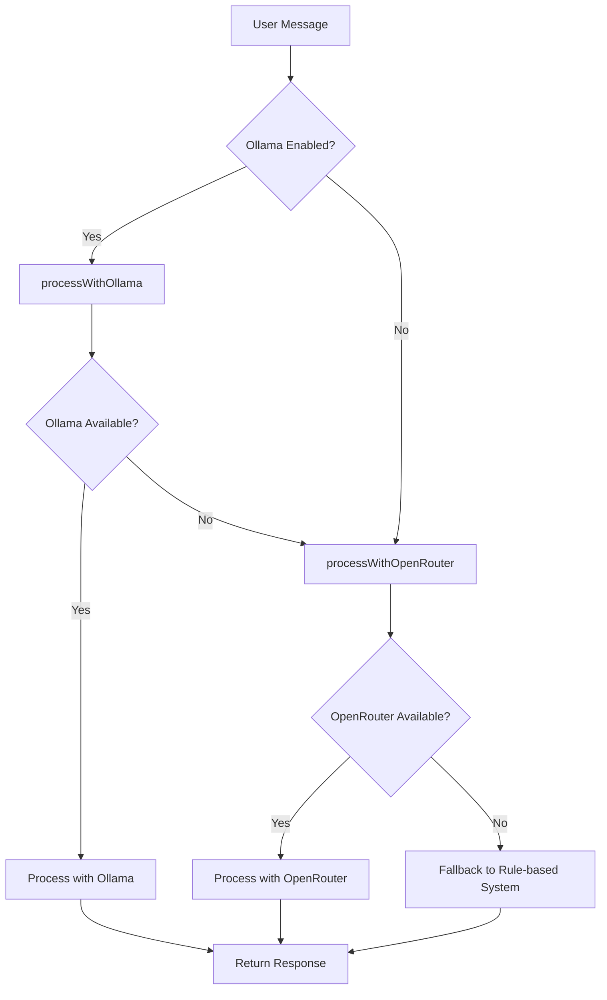
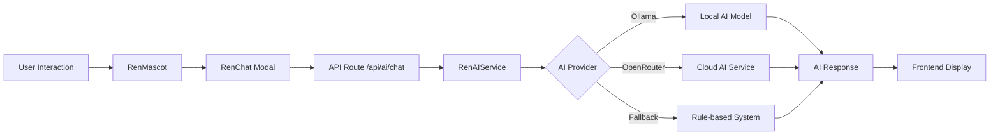

# REN Issues Fix Design Document

## Overview

This document outlines the fixes required for the REN AI assistant in the RenThing platform. The issues include:
1. Improper Ollama integration causing fallback to default responses
2. Non-functional trash icon in REN chat modal
3. Excessive vibrations/shaking of REN circle modal
4. Chat modal positioning in center instead of lower right corner
5. Prisma integration issues causing "Failed to fetch listings" and login problems

## Architecture

The RenThing platform follows a Next.js-based full-stack architecture with:
- Frontend: React with TypeScript, Tailwind CSS, Framer Motion
- Backend: Custom Express.js server integrated with Next.js API routes
- Database: Prisma ORM with SQLite (default) or PostgreSQL
- AI Integration: Ollama for local AI model deployment

The REN AI system consists of:
- `RenMascot` component for the floating circle icon
- `RenChat` component for the chat interface
- `RenAIService` for backend AI processing
- API routes for communication between frontend and backend

## Issues Analysis and Solutions

### 1. REN Intelligence - Ollama Integration Fix

#### Problem
The system is giving fallback messages instead of properly utilizing the Ollama local AI model. The `processWithOllama` method is missing from the `ren-ai-service.ts` file.

#### Solution
Implement the `processWithOllama` method in the AI service to properly handle communication with the Ollama API before falling back to OpenRouter.

#### Implementation Steps
1. Add `processWithOllama` method to `RenAIService` class
2. Implement proper error handling for Ollama connection issues
3. Update environment variable checks
4. Add fallback mechanism to OpenRouter when Ollama fails

#### Technical Implementation
1. Add the missing `processMessage` method to RenAIService class that orchestrates AI processing
2. Implement `processWithOllama` method that sends requests to the Ollama API endpoint
3. Format the prompt properly for the Ollama model with system context
4. Handle streaming responses from Ollama with proper error handling
5. Implement `processWithOpenRouter` method as a fallback when Ollama is unavailable
6. Add rule-based fallback system for when both AI services are unavailable
7. Ensure all methods return a properly formatted AIResponse object
8. Add environment variable checks for OLLAMA_ENABLED flag
9. Implement proper logging for debugging AI service issues

### 2. Trash Icon Functionality in REN Chat Modal

#### Problem
The trash icon in the REN chat modal doesn't clear the currently opened chat modal as expected.

#### Solution
The trash icon functionality exists in the client layout but needs to be properly connected to clear the chat messages. The `clearChatHistory` function is already implemented but needs to properly reset the chat state.

#### Implementation Steps
1. Ensure the trash icon button properly calls the `clearChatHistory` function
2. Verify that the function resets both component state and localStorage
3. Confirm that the welcome message is properly restored after clearing

#### Technical Implementation
1. Add onClick handler to the trash icon button that calls `clearChatHistory`
2. Ensure the function properly updates the `chatMessages` state
3. Verify localStorage is cleared and reset with welcome message
4. Test that UI updates correctly after clearing
5. Add confirmation dialog to prevent accidental clearing
6. Ensure animations work properly after clearing
7. Verify that the chat modal remains open after clearing (not minimized or closed)

### 3. REN Circle Modal Vibrations/Shaking

#### Problem
The REN circle modal has excessive vibrations/shaking animations that need to be toned down to a subtle floating motion.

#### Solution
Replace the current animation implementation with a subtle floating animation using CSS keyframes or Framer Motion.

#### Implementation Steps
1. Remove or modify the current wave animation implementation
2. Implement a subtle floating animation using CSS or Framer Motion
3. Ensure the animation is smooth and not distracting

#### Technical Implementation
1. Replace the `isWaving` state and interval with a continuous subtle floating animation
2. Use CSS keyframes or Framer Motion `animate` prop for smooth animation
3. Reduce animation intensity to create a gentle floating effect
4. Ensure animation doesn't cause performance issues
5. Add animation controls to allow users to disable animations if needed
6. Implement smooth easing functions for natural movement
7. Ensure the animation is consistent across different devices

### 4. REN Chat Modal Positioning

#### Problem
The chat modal appears in the center of the screen instead of the lower right corner near the REN circle icon.

#### Solution
Modify the chat modal positioning to appear as a small vertical rectangle in the lower right corner above the REN circle icon.

#### Implementation Steps
1. Update the modal positioning CSS to appear in the lower right corner
2. Adjust the modal dimensions to be a vertical rectangle
3. Ensure proper z-index stacking
4. Implement smooth entrance/exit animations

#### Technical Implementation
1. Change the modal container from `fixed inset-0` to `fixed bottom-24 right-4`
2. Adjust width/height to create a vertical rectangle (e.g., w-80 h-96)
3. Position above the REN mascot icon
4. Update entrance/exit animations for slide-up effect
5. Ensure responsive design for different screen sizes
6. Add proper z-index management to ensure correct layering
7. Implement mobile-responsive design that works on all screen sizes
8. Add shadow and border styling for visual separation

### 5. Prisma Integration Issues

#### Problem
Prisma integration is failing with "Failed to fetch listings" and login issues for existing accounts.

#### Solution
Fix the Prisma client initialization and database connection issues.

#### Implementation Steps
1. Review and fix Prisma client instantiation in `prisma.ts`
2. Verify database connection string in environment variables
3. Check authentication flow in `auth.ts`
4. Ensure proper error handling for database operations

#### Technical Implementation
1. Fix Prisma client initialization to handle missing environment variables gracefully
2. Add proper error logging for database connection failures
3. Implement fallback mechanisms for critical database operations
4. Verify bcrypt integration for password hashing in authentication
5. Test database connectivity with seed data
6. Fix "Failed to fetch listings" error by implementing proper error handling
7. Ensure database queries have proper fallback responses
8. Add connection pooling for better database performance
9. Implement retry mechanisms for transient database errors

## Component Architecture

### RenMascot Component
- Floating circle icon that serves as the entry point for REN chat
- Positioned in the lower right corner of the screen
- Features subtle floating animation
- Triggers chat modal when clicked

### RenChat Component
- Chat interface for interacting with REN AI
- Positioned in the lower right corner above the mascot
- Features message history, input field, and suggestion buttons
- Includes trash icon for clearing chat history

### RenAIService
- Backend service for processing AI requests
- Implements Ollama integration as primary AI provider
- Falls back to OpenRouter when Ollama is unavailable
- Provides rule-based responses as final fallback

## Data Flow

## API Endpoints Reference

### AI Chat Endpoint
- **URL**: `/api/ai/chat`
- **Method**: POST
- **Description**: Process user messages with AI service
- **Request Body**: 
  - `message`: string - User's input message
  - `context`: AIContext - User and conversation context
- **Response**: AIResponse - AI-generated response

### Authentication Endpoint
- **URL**: `/api/auth/callback/credentials`
- **Method**: POST
- **Description**: Authenticate users with email/password
- **Request Body**: 
  - `email`: string - User's email
  - `password`: string - User's password
- **Response**: Session token or error

### Listings Endpoint
- **URL**: `/api/listings`
- **Method**: GET
- **Description**: Fetch rental listings
- **Response**: Array of listing objects

## Business Logic Layer

### AI Service Processing Logic
1. Receive user message and context
2. Check if Ollama is enabled and available
3. If available, process with Ollama
4. If Ollama fails, try OpenRouter
5. If both fail, use rule-based fallback
6. Return formatted response to frontend

### Authentication Logic
1. Validate user credentials
2. Hash and compare password
3. Create session token
4. Return user data and session

### Chat History Management
1. Load chat history from localStorage on component mount
2. Save chat history to localStorage on message changes
3. Clear chat history when trash icon is clicked
4. Reset to welcome message after clearing

## Middleware & Interceptors

### Session Middleware
- Validates user authentication status
- Attaches user data to requests
- Handles session expiration

### Rate Limiting Middleware
- Prevents abuse of AI services
- Limits requests per user/IP
- Returns appropriate error responses

### Error Handling Middleware
- Catches and logs errors
- Returns user-friendly error messages
- Ensures graceful degradation

## Testing Strategy

### Unit Tests
1. Test Ollama integration function with mock responses
2. Test chat history management functions
3. Test authentication service with valid/invalid credentials
4. Test Prisma client initialization

### Integration Tests
1. Test complete AI chat flow from frontend to backend
2. Test authentication flow with database
3. Test listing fetching with Prisma

### End-to-End Tests
1. Test REN chat functionality in browser
2. Test user login/logout flows
3. Test listing browsing and booking flows

## Conclusion

This design document outlines a comprehensive approach to fixing the key issues with the REN AI assistant in the RenThing platform. The main problems identified were:

1. Missing AI processing methods in the backend service
2. Non-functional UI elements in the chat interface
3. Excessive animations that detract from user experience
4. Database connectivity issues affecting core functionality

The proposed solutions address each of these issues with a systematic approach that prioritizes:

- **Reliability**: Implementing proper error handling and fallback mechanisms
- **User Experience**: Improving UI/UX with subtle animations and better positioning
- **Performance**: Optimizing database queries and AI processing
- **Maintainability**: Following established patterns and adding proper logging

With these fixes implemented, the REN AI assistant will provide a more reliable and pleasant user experience while maintaining the core functionality of the rental marketplace platform.

## Implementation Plan

### Phase 1: Prisma and Authentication Fixes
1. Fix Prisma client initialization
2. Resolve database connection issues
3. Fix authentication flow
4. Test login functionality

### Phase 2: REN AI Intelligence Enhancement
1. Implement missing `processMessage` method in RenAIService
2. Implement `processWithOllama` method for local AI processing
3. Implement `processWithOpenRouter` method as fallback
4. Add proper error handling for AI services
5. Test Ollama integration
6. Verify fallback mechanisms

### Phase 3: UI/UX Improvements
1. Fix trash icon functionality
2. Implement subtle floating animation
3. Reposition chat modal to lower right corner
4. Test all UI interactions

### Phase 4: Testing and Validation
1. Run unit tests for all components
2. Perform integration testing
3. Conduct end-to-end testing
4. Validate fixes with user scenarios

## Files to be Modified

### Backend Files
1. `ren-ai/services/ren-ai-service.ts` - Add missing processMessage method and Ollama integration
2. `lib/prisma.ts` - Fix Prisma client initialization
3. `lib/auth.ts` - Fix authentication flow issues

### Frontend Files
1. `app/client-layout.tsx` - Fix trash icon functionality and chat modal positioning
2. `ren-ai/components/ren-mascot.tsx` - Fix animations and floating effect
3. `ren-ai/components/ren-chat.tsx` - Ensure proper integration with client layout

## Validation and Testing Criteria

### AI Service Validation
1. Ollama integration works when `OLLAMA_ENABLED=true`
2. OpenRouter is used as fallback when Ollama is disabled or unavailable
3. Rule-based system works when both AI services are unavailable
4. Response time is acceptable for all AI processing methods
5. Error handling works correctly for all failure scenarios

### UI/UX Validation
1. Trash icon properly clears chat history
2. REN mascot has subtle floating animation (no excessive shaking)
3. Chat modal appears in lower right corner as vertical rectangle
4. Chat modal animations are smooth and not distracting
5. Chat modal positioning works on all screen sizes

### Database Validation
1. User can log in to existing accounts
2. Listings can be fetched without errors
3. Database operations have proper error handling
4. Authentication flow works correctly
5. Prisma client initializes without errors

## Risk Mitigation

1. **Database Issues**: Ensure proper backup before making Prisma changes
2. **AI Service Downtime**: Implement graceful fallbacks to prevent complete service failure
3. **UI Regression**: Test all pages to ensure chat modal changes don't break layout
4. **Performance Impact**: Monitor animation performance on lower-end devices
5. **Cross-browser Compatibility**: Test fixes on major browsers (Chrome, Firefox, Safari)