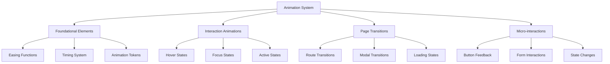

# UI/UX Animation Revamp Design Document

## 1. Overview

This document outlines the comprehensive revamp of UI/UX animations across the entire RenThing web application. The goal is to enhance user experience through consistent, performant, and engaging animations while maintaining the application's modern aesthetic.

The application currently uses Framer Motion as its primary animation library, with some Tailwind CSS animations. This revamp will standardize animation patterns, improve performance, and create a cohesive animation language throughout the application.

## 2. Current State Analysis

### 2.1 Existing Animation Libraries

- **Framer Motion**: Primary animation library (v12.23.12)
- **Tailwind CSS**: Basic animations and transitions
- **Tailwind CSS Animate Plugin**: For extended animation utilities

### 2.2 Current Animation Implementations

1. **AI Components**:
   - REN Mascot with floating and entrance animations
   - Chat Widget with modal transitions
   - REN Chat with message animations

2. **UI Components**:
   - Button hover and tap effects
   - Toast notifications with slide-in/out animations
   - Modal transitions
   - Page transitions with loading states

3. **Page Elements**:
   - Listing cards with hover effects
   - Header with mobile menu transitions
   - Aurora text effects on landing pages

### 2.3 Identified Issues

1. **Inconsistency**: Different animation styles and timings across components
2. **Performance**: Some animations may cause layout thrashing
3. **Accessibility**: Lack of reduced motion considerations
4. **User Experience**: Missing visual feedback in some interactions

## 3. Animation System Architecture

### 3.1 Core Principles

1. **Performance First**: Use hardware-accelerated properties (transform, opacity)
2. **Consistency**: Unified timing, easing, and animation patterns
3. **Accessibility**: Respect user motion preferences
4. **Purposeful**: Every animation should serve a functional purpose

### 3.2 Animation Hierarchy



### 3.3 Animation Tokens

| Token Name | Value | Usage |
|------------|-------|-------|
| `duration.fast` | 150ms | Immediate feedback |
| `duration.normal` | 300ms | Standard transitions |
| `duration.slow` | 500ms | Page transitions |
| `easing.standard` | `cubic-bezier(0.4, 0, 0.2, 1)` | Default easing |
| `easing.accelerate` | `cubic-bezier(0.4, 0, 1, 1)` | Entrance animations |
| `easing.decelerate` | `cubic-bezier(0, 0, 0.2, 1)` | Exit animations |

## 4. Component Animation Specifications

### 4.1 Page Transitions

**Implementation Pattern**:
```tsx
<motion.div
  initial={{ opacity: 0, y: 20 }}
  animate={{ opacity: 1, y: 0 }}
  exit={{ opacity: 0, y: -20 }}
  transition={{ 
    duration: 0.3, 
    ease: [0.4, 0, 0.2, 1] 
  }}
>
  {/* Page Content */}
</motion.div>
```

**Characteristics**:
- Fade in with slight upward movement
- Duration: 300ms
- Easing: Standard decelerate curve
- Staggered child elements with 50ms delays

### 4.2 Button Interactions

**Implementation Pattern**:
```tsx
<motion.button
  whileHover={{ scale: 1.03 }}
  whileTap={{ scale: 0.98 }}
  transition={{ type: "spring", stiffness: 500, damping: 30 }}
>
  Click Me
</motion.button>
```

**Characteristics**:
- Hover: Subtle scale increase (3%)
- Tap: Compress effect (2%)
- Physics: Spring-based for natural feel
- Duration: 150ms for hover, 100ms for tap

### 4.3 Card Components

**Implementation Pattern**:
```tsx
<motion.div
  initial={{ opacity: 0 }}
  animate={{ opacity: 1 }}
  whileHover={{ 
    y: -8,
    transition: { duration: 0.2, ease: "easeOut" }
  }}
  transition={{ duration: 0.3 }}
>
  {/* Card Content */}
</motion.div>
```

**Characteristics**:
- Entrance: Fade in with 300ms duration
- Hover: Lift effect (8px) with shadow enhancement
- Staggered entrance for lists (50ms delays)

### 4.4 Form Elements

**Implementation Pattern**:
```tsx
<motion.div
  initial={false}
  animate={{ 
    borderColor: isValid ? "#10B981" : "#EF4444",
    transition: { duration: 0.2 }
  }}
>
  <input />
</motion.div>
```

**Characteristics**:
- Validation feedback with color transitions
- Focus states with subtle glow effects
- Error states with shake animation

### 4.5 Navigation Elements

**Implementation Pattern**:
```tsx
<motion.div
  animate={{ 
    backgroundColor: isActive ? "#3B82F6" : "transparent",
    color: isActive ? "#FFFFFF" : "#6B7280"
  }}
  transition={{ duration: 0.2 }}
>
  Menu Item
</motion.div>
```

**Characteristics**:
- Active state transitions
- Hover effects with background color shifts
- Mobile menu slide animations

## 5. Animation Patterns by Component Type

### 5.1 Lists and Grids

**Staggered Animations**:
```tsx
{items.map((item, index) => (
  <motion.div
    key={item.id}
    initial={{ opacity: 0, y: 20 }}
    animate={{ opacity: 1, y: 0 }}
    transition={{ 
      duration: 0.3, 
      delay: index * 0.05 
    }}
  >
    {item.content}
  </motion.div>
))}
```

### 5.2 Modals and Dialogs

**Entrance Animation**:
```tsx
<motion.div
  initial={{ opacity: 0, scale: 0.9 }}
  animate={{ opacity: 1, scale: 1 }}
  exit={{ opacity: 0, scale: 0.9 }}
  transition={{ 
    type: "spring", 
    stiffness: 300, 
    damping: 30 
  }}
>
  {/* Modal Content */}
</motion.div>
```

### 5.3 Loading States

**Skeleton Loading**:
```tsx
<motion.div
  animate={{ opacity: [0.5, 1, 0.5] }}
  transition={{ 
    duration: 1.5, 
    repeat: Infinity,
    ease: "easeInOut"
  }}
>
  {/* Loading Content */}
</motion.div>
```

## 6. Performance Optimization Strategies

### 6.1 Hardware Acceleration

- Use `transform` and `opacity` for animations
- Leverage `will-change` property for complex animations
- Implement `transform3d` to trigger GPU acceleration

### 6.2 Animation Throttling

- Limit simultaneous animations to 5-7 elements
- Implement animation queuing for list items
- Use `framer-motion`'s `AnimatePresence` for efficient mount/unmount

### 6.3 Reduced Motion Support

```tsx
const prefersReducedMotion = useReducedMotion();

const animationVariants = {
  normal: { opacity: 1, y: 0 },
  reduced: { opacity: 1 }
};

<motion.div
  initial={{ opacity: 0, y: 20 }}
  animate={prefersReducedMotion ? "reduced" : "normal"}
  variants={animationVariants}
/>
```

## 7. Accessibility Considerations

### 7.1 Motion Preferences

- Respect `prefers-reduced-motion` media query
- Provide alternative visual feedback when animations are disabled
- Ensure all functionality is accessible without animations

### 7.2 Focus Management

- Maintain clear focus indicators during animations
- Ensure keyboard navigation is not disrupted
- Provide sufficient time for users to perceive animated content

## 8. Implementation Roadmap

### 8.1 Phase 1: Foundation (Week 1-2)

1. Establish animation tokens and design system
2. Create shared animation utilities and hooks
3. Implement consistent easing and timing system
4. Set up reduced motion support

### 8.2 Phase 2: Core Components (Week 3-4)

1. Update button animations
2. Implement card hover effects
3. Standardize form element animations
4. Enhance navigation transitions

### 8.3 Phase 3: Page Transitions (Week 5-6)

1. Implement route transitions
2. Add modal and dialog animations
3. Create loading state animations
4. Optimize performance for complex pages

### 8.4 Phase 4: Micro-interactions (Week 7-8)

1. Add feedback animations for user actions
2. Implement state change animations
3. Enhance form validation feedback
4. Add delighter animations for key interactions

## 9. Testing and Validation

### 9.1 Performance Metrics

- Frame rate should maintain 60fps during animations
- Animation duration should not exceed 500ms for non-entrance animations
- Memory usage should not increase significantly with animations

### 9.2 User Experience Validation

- Conduct usability testing with animation variations
- Gather feedback on animation timing and intensity
- Validate accessibility with screen reader users

### 9.3 Cross-browser Compatibility

- Test animations on latest Chrome, Firefox, Safari, and Edge
- Ensure fallbacks for older browsers
- Validate mobile performance on iOS and Android

## 10. Maintenance and Documentation

### 10.1 Animation Guidelines

- Create a style guide documenting animation principles
- Establish naming conventions for animation variants
- Provide code examples for common animation patterns

### 10.2 Performance Monitoring

- Set up performance monitoring for animation-heavy pages
- Create benchmarks for animation performance
- Implement alerts for performance degradation

This animation revamp will significantly enhance the user experience of the RenThing application while maintaining high performance standards and accessibility compliance.